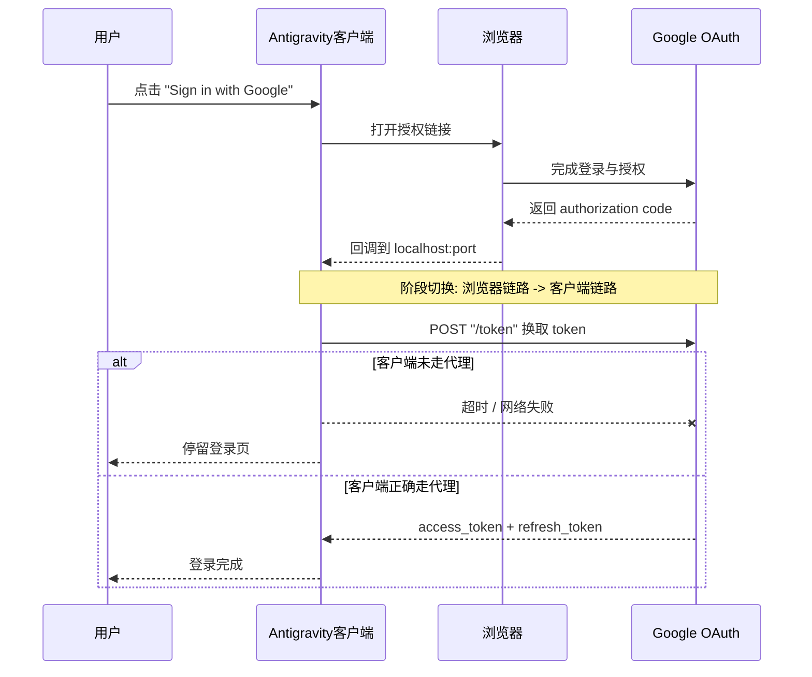

# Antigravity 登录卡死排查实录：Google 网页已登录，但客户端没反应

在尝试登录 Antigravity 时，我遇到了一个很迷惑的现象：

- 点击 "Sign in with Google"，浏览器弹出登录页；
- 在浏览器里完成了 Google 授权，页面显示成功；
- 回到 Antigravity 客户端，却一直停在登录页，毫无反应。

Antigravity 界面里出现了这样一段报错：

```
Post "https://oauth2.googleapis.com/token":
dial tcp [2404:6800:4008:c04::5f]:443:
connectex: A connection attempt failed because the connected party did not
properly respond after a period of time, or established connection failed
because connected host has failed to respond.
```

## 排查过程

### 第一步：以为是节点问题

最直觉的反应是 VPN 节点不稳定，于是换了更稳定的节点，并开启了 TUN 模式，让所有流量都走代理。

**结果：还是失败。**

### 第二步：以为是账号地区问题

想到 Gemini 有地区限制，于是把 Google 账号关联的国家/地区改成了支持 Gemini 的地区。

**结果：依然失败。**

### 第三步：定位真正的问题

仔细看了报错，关键信息是：

```
Post "https://oauth2.googleapis.com/token": dial tcp ... connectex: 连接超时
```

这说明问题不在"登录"这一步，而在登录后的 **token 交换**这一步——即用 `authorization code` 去换 `access_token` 时，请求根本发不出去。

## 问题本质：浏览器和客户端是两个独立进程

这是很多人忽略的一点：**浏览器走代理，不代表客户端进程也走代理。**

Google OAuth 登录分两个阶段：

1. **浏览器阶段**：打开授权页 → 用户登录 → Google 返回 `authorization code` 回调给 localhost；
2. **客户端阶段**：Antigravity 进程拿着 `code`，向 `oauth2.googleapis.com/token` 发 POST 请求换取 token。

阶段一在浏览器里完成，浏览器走了代理，当然成功。  
阶段二由 **Antigravity 进程本身**发出请求，如果这个进程没有配置代理，就直连——而直连在国内访问不到 Google，于是超时卡死。



## 解决方案：让客户端进程走代理

我使用的是 **Clash for Windows 0.20.16**，尝试过开启全局代理、TUN 模式，并切换香港、日本、美国等节点，均无法正常完成登录授权。

真正有效的办法是：**为 CMD 会话设置代理环境变量**，指向 Clash for Windows 的 HTTP 端口（默认 `7897`）。

### 方案一：临时生效（仅当前 CMD 会话）

在 CMD 中执行以下命令后，再启动 Antigravity：

```bat
set http_proxy=http://127.0.0.1:7897
set https_proxy=http://127.0.0.1:7897
```

`set` 设置的变量只在当前窗口有效，关闭 CMD 后自动失效。

### 方案二：永久生效（当前用户环境变量）

```bat
setx http_proxy http://127.0.0.1:7897
setx https_proxy http://127.0.0.1:7897
```

`setx` 会写入当前用户的环境变量，**重新打开任意 CMD 窗口后即生效**，无需每次手动设置。

也可以直接在「系统属性 → 环境变量」里手动添加 `http_proxy` 和 `https_proxy` 两个用户变量，效果相同。

> **注意**：Clash for Windows 的 HTTP 端口默认是 `7897`，如果你改过端口，替换成实际端口号即可。

### 验证方式

修复后，验证不能只看"浏览器那边显示成功"，要以 **客户端出现登录后的状态** 为准：

1. 客户端界面进入已登录状态（不再停留登录页）；
2. 重启 Antigravity，重新走一遍登录流程，结果仍然一致。

只要"这一次成功"但重启后又不行，说明环境变量没有永久化，问题随时会复发。

## 常见误判清单

| 误判方向 | 为什么会误判 | 实际情况 |
|---|---|---|
| Google 账号异常 | 浏览器端全程没报错 | 账号本身没问题，是网络出口问题 |
| VPN 节点不稳 | 换节点后仍失败 | 节点没问题，是进程没走代理 |
| 地区限制 | Gemini 有地区要求 | 地区改了也没用，根本原因是 token 请求发不出去 |
| TUN 模式已开就没问题 | TUN 看起来覆盖了全部流量 | 部分场景下进程仍可能未被接管，需单独设置环境变量 |

## 结语

这个问题的核心不是"登录坏了"，而是 **OAuth 认证流程在跨进程切换时，网络出口不一致**。  
浏览器的代理和客户端进程的代理是彼此独立的，搞清楚这一点，遇到类似问题就能快速定位，不用再盲试了。